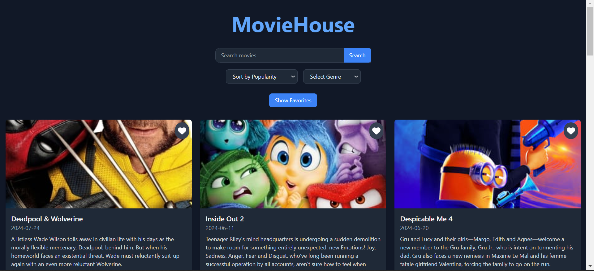
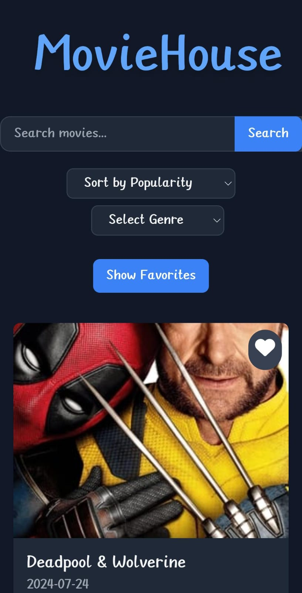

# Movie Search Application

## Project Overview

This movie search application allows users to search for any movie, add movies to a favorites list, and sort movies by popularity, rating, or release date. Users can also filter movies by genres, providing a personalized movie browsing experience. The app features a clean and responsive user interface, ensuring smooth navigation across different devices and screen sizes.

### Features:
- Search for movies by title.
- Add movies to a favorites list.
- Sort movies by popularity, rating, or release date.
- Filter movies by genre.
- Responsive design for both mobile and desktop views.

---

## Set Up and Run Locally

### Prerequisites
- Node.js (v14 or higher)
- npm (v6 or higher)
- Git

### Instructions

1. Clone the repository:

    bash
    git clone https://github.com/your-username/movie-search-app.git
    cd movie-search-app
    

2. Install the dependencies:

    bash
    npm install
    

3. Create a .env file in the root directory and add your Movie Database API key:

    plaintext
    REACT_APP_MOVIE_API_KEY=your-api-key
    

4. Run the application locally:

    bash
    npm start
    

The app will be available at [http://localhost:3000](http://localhost:3000).

---

## API Usage

This app uses [The Movie Database (TMDb) API](https://developers.themoviedb.org/3) to fetch movie data.

### API Endpoints
1. *Search for Movies:*
   - *Endpoint:* https://api.themoviedb.org/3/search/movie?query={query}&api_key={API_KEY}
   - *Parameters:*
     - query: Movie title or keywords.
     - API_KEY: Your personal TMDb API key.

2. *Get Popular Movies:*
   - *Endpoint:* https://api.themoviedb.org/3/movie/popular?api_key={API_KEY}
   - Provides a list of popular movies.

3. *Filter Movies by Genre:*
   - *Endpoint:* https://api.themoviedb.org/3/discover/movie?with_genres={genre_id}&api_key={API_KEY}
   - *Parameters:*
     - genre_id: The ID of the selected genre.

---

## Screenshots

### Desktop View

### Mobile View

---

## Approach

The app is built using React for the frontend, with state management for storing the list of favorite movies and filtered search results. API requests are made using the fetch method, and sorting is handled on the client-side to allow users to reorder the movie lists based on popularity, rating, and release date.

- *Frontend*: Built using React with custom CSS for styling.
- *State Management*: The app stores and manages movie data and user favorites using React's state management.
- *Sorting and Filtering*: Sorting is applied on the client side, while genres are fetched and filtered through the TMDb API.

---